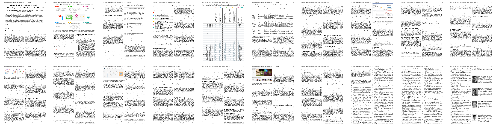
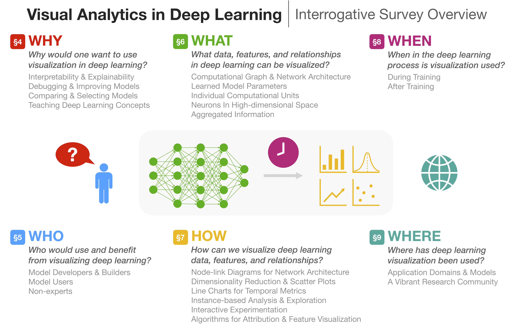

<span class="names squeeze">
[Fred Hohman][fred], [Minsuk Kahng][minsuk], [Robert Pienta][robert], [Duen Horng Chau][polo]
<span>

<!-- <p class="test">asdf</p> -->

<p class="squeeze">
Deep learning has recently seen rapid development and significant attention due to its state-of-the-art performance on previously-thought hard problems.
However, because of the innate complexity and nonlinear structure of deep neural networks, the underlying decision making processes for why these models are achieving such high performance are challenging and sometimes mystifying to interpret.
</p>

<p class="squeeze">
As deep learning spreads across domains, it is of paramount importance that we equip users of deep learning with tools for understanding when a model works correctly, when it fails, and ultimately how to improve its performance. 
Standardized toolkits for building neural networks have helped democratize deep learning; visual analytics systems have now been developed to support model explanation, interpretation, debugging, and improvement.
</p>

<div class="material">
  <a href="https://arxiv.org/abs/1801.06889">
  
  </a>
</div>
<div class="table-caption">
Read the paper.
</div>

<p class="squeeze">
We present a survey of the role of visual analytics in deep learning research, noting its short yet impactful history and summarize the state-of-the-art using a human-centered interrogative framework, focusing on the Five W’s and How (<span class="why">Why</span>, <span class="who">Who</span>, <span class="what">What</span>, <span class="how">How</span>, <span class="when">When</span>, and <span class="where">Where</span>), to thoroughly summarize deep learning visual analytics research.
We conclude by highlighting research directions and open research problems.
</p>

<p class="squeeze">
This survey helps new researchers and practitioners in both visual analytics and deep learning to quickly learn key aspects of this young and rapidly growing body of research, whose impact spans a diverse range of domains.
</p>

<div class="material">
  
</div>

<p class="squeeze">
Overview of representative works in visual analytics for deep learning. Each row is one work; works are sorted alphabetically by first author’s lastname. Each column corresponds to a subsection from the six interrogative questions. A work’s relevant subsection is indicated by a colored cell.
</p>

<table>

  <tr class="top-row">

    <td><div>&nbsp;</div></td>
    <td><div>&nbsp;</div></td>

    <td colspan="4" class="question-title" id="why-title"><div>WHY</div></td>
    <!-- <td><div>asdf</div></td> -->
    <!-- <td><div>asdf</div></td> -->
    <!-- <td><div>asdf</div></td> -->

    <td colspan="3" class="question-title" id="who-title"><div>WHO</div></td>
    <!-- <td><div>asdf</div></td> -->
    <!-- <td><div>asdf</div></td> -->

    <td colspan="5" class="question-title" id="what-title"><div>WHAT</div></td>
    <!-- <td><div>asdf</div></td> -->
    <!-- <td><div>asdf</div></td> -->
    <!-- <td><div>asdf</div></td> -->
    <!-- <td><div>asdf</div></td> -->

    <td colspan="6" class="question-title" id="how-title"><div>HOW</div></td>
    <!-- <td><div>asdf</div></td> -->
    <!-- <td><div>asdf</div></td> -->
    <!-- <td><div>asdf</div></td> -->
    <!-- <td><div>asdf</div></td> -->
    <!-- <td><div>asdf</div></td> -->

    <td colspan="2" class="question-title" id="when-title"><div>WHEN</div></td>
    <!-- <td><div>asdf</div></td> -->

    <td colspan="1" class="question-title" id="where-title"><div>WHERE</div></td>

  </tr>

<!-- <tr class="bordered">&nbsp;</tr> -->

  <tr>
      
      <td class="rotate"><div><span>{{ field.field }}</span></div></td>
    
  </tr>

    
    <tr class="work">

      <td class="author"><a href="{{work.url}}">{{ work.author }}</a></td>
      <td class="year">{{ work.year }}</td>

      <!-- why -->
      
        <td class="checked interpretability"><span>&nbsp;</span></td><td class="interpretability"></td>
        <td class="checked debugging"><span>&nbsp;</span></td><td class="debugging"></td>
        <td class="checked comparing"><span>&nbsp;</span></td><td class="comparing"></td>
        <td class="checked education"><span>&nbsp;</span></td><td class="education"></td>
      

      
        <td class="checked model-developers"><span>&nbsp;</span></td><td class="model-developers"></td>
        <td class="checked model-users"><span>&nbsp;</span></td><td class="model-users"></td>
        <td class="checked non-experts"><span>&nbsp;</span></td><td class="non-experts"></td>
      

      
        <td class="checked graph"><span>&nbsp;</span></td><td class="graph"></td>
        <td class="checked learned"><span>&nbsp;</span></td><td class="learned"></td>
        <td class="checked units"><span>&nbsp;</span></td><td class="units"></td>
        <td class="checked neurons"><span>&nbsp;</span></td><td class="neurons"></td>
        <td class="checked aggregated"><span>&nbsp;</span></td><td class="aggregated"></td>
      

      
        <td class="checked node-link"><span>&nbsp;</span></td><td class="node-link"></td>
        <td class="checked scatter"><span>&nbsp;</span></td><td class="scatter"></td>
        <td class="checked line"><span>&nbsp;</span></td><td class="line"></td>
        <td class="checked instance-based"><span>&nbsp;</span></td><td class="instance-based"></td>
        <td class="checked interactive-experimentation"><span>&nbsp;</span></td><td class="interactive-experimentation"></td>
        <td class="checked algorithms"><span>&nbsp;</span></td><td class="algorithms"></td>
      

      
        <td class="checked during"><span>&nbsp;</span></td><td class="during"></td>
        <td class="checked after"><span>&nbsp;</span></td><td class="after"></td>
      

      
        <td class="venue">{{ topic.venue }}</td>
      
    </tr>
    

</table>

<div class="table-caption">
  <br>
  <a href="https://github.com/fredhohman/visual-analytics-in-deep-learning#add-a-new-work" style="color: #777777"><i class="material-icons" style="font-size: 32px !important;">add_circle_outline</i></a>
  <br>
  Add a new paper
  <br>
  <br>
  <span class="submission-message"><b>Note:</b> Works published after our survey paper's publication date (June 2018) appear below the black horizontal line.</span>
</div>

<hr>

<div class="person-wrapper">

  <div class="person">
    <div class="image-cropper">
      <a href="https://fredhohman.com">
        
      </a>
    </div>
    <a href="https://fredhohman.com">Fred Hohman</a>
    <span class="person-description small">PhD Student</span>
    <span class="person-description small">Georgia Tech</span>
  </div>

  <div class="person">
    <div class="image-cropper">
      <a href="https://minsuk.com">
        
      </a>
    </div>
    <a href="https://minsuk.com">Minsuk Kahng</a>
    <span class="person-description small">PhD Student</span>
    <span class="person-description small">Georgia Tech</span>
  </div>

  <div class="person">
    <div class="image-cropper">
      <a href="http://spicy.bike/">
        
      </a>
    </div>
    <a href="http://spicy.bike/">Robert Pienta</a>
    <span class="person-description small">Research Scientist</span>
    <span class="person-description small">Symantec</span>
  </div>

  <div class="person">
    <div class="image-cropper">
      <a href="https://www.cc.gatech.edu/~dchau/">
        
      </a>
    </div>
    <a href="https://www.cc.gatech.edu/~dchau/">Duen Horng Chau</a>
    <span class="person-description small">Associate Professor</span>
    <span class="person-description small">Georgia Tech</span>
  </div>

</div>

**Visual Analytics in Deep Learning: An Interrogative Survey for the Next Frontiers**  
[Fred Hohman][fred], [Minsuk Kahng][minsuk], [Robert Pienta][robert], [Duen Horng Chau][polo].  
*IEEE Transactions on Visualization and Computer Graphics (TVCG). 2018.*  

<div style="height:5px"></div>

```latex
@article{hohman2018visual,
  title={Visual Analytics in Deep Learning: An Interrogative Survey for the Next Frontiers},
  author={Hohman, Fred and Kahng, Minsuk and Pienta, Robert and Chau, Duen Horng},
  journal={IEEE Transactions on Visualization and Computer Graphics},
  year={2018},
  publisher={IEEE}
}
```

<!-- Markdown footnotes are supported, and they look great! Simply put e.g. `[^1]` where you want the footnote to appear,[^1] and then add -->
<!-- the reference at the end of your markdown. -->
<!-- <blockquote>
  <p>
    Perfection is achieved, not when there is nothing more to add, but when there is nothing left to take away.
  </p>
  <footer><cite title="Antoine de Saint-Exupéry">Antoine de Saint-Exupéry</cite></footer>
</blockquote> -->


<!-- --- -->

<!-- [^1]: Important information that may distract from the main text can go in footnotes. -->

[fred]: https://fredhohman.com "Fred Hohman."
[minsuk]: https://minsuk.com/ "Minsuk Kahng."
[robert]: http://spicy.bike/ "Robert Pienta."
[polo]: https://www.cc.gatech.edu/~dchau/ "Polo Chau."